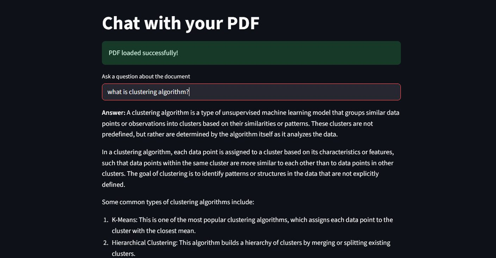

# RAG PDF Document Assistant

## Overview
The **RAG PDF Document Assistant** is a Streamlit-based web application that allows users to interact with PDF documents using a conversational interface. By leveraging advanced language models and embeddings, the application enables users to ask questions about the content of a PDF and receive accurate, context-aware responses.

## screenshot 


## Features
- **PDF Parsing**: Extracts text from PDF documents.
- **Text Chunking**: Splits large documents into smaller, manageable chunks for efficient processing.
- **Embeddings**: Converts text into numerical vectors for similarity search.
- **Vector Search**: Uses FAISS for fast and accurate similarity-based retrieval.
- **Conversational Interface**: Integrates with Groq's hosted LLM models to provide a seamless Q&A experience.

## How It Works
1. **Load PDF**: The application reads a local PDF file.
2. **Text Splitting**: The document is divided into smaller chunks using `RecursiveCharacterTextSplitter`.
3. **Create Embeddings**: Text chunks are converted into embeddings using `HuggingFaceEmbeddings`.
4. **Vector Store**: Embeddings are stored in a FAISS vector database for efficient retrieval.
5. **Question Answering**: User queries are processed using `RetrievalQA`, which combines the retriever and LLM to generate responses.

## Installation

1. Clone the repository:
   ```bash
   git clone <repository-url>
   cd rag-pdf-document-assistant
   ```

2. Install dependencies:
   ```bash
   pip install -r requirements.txt
   ```

3. Set up environment variables:
   - Create a `.env` file in the project root.
   - Add your Groq API key:
     ```
     GROQ_API_KEY=your_api_key_here
     ```

## Usage

1. Run the application:
   ```bash
   streamlit run main.py
   ```

2. Open the application in your browser at `http://localhost:8501`.

3. Upload a PDF file and start asking questions!

## Requirements
- Python 3.8+
- Libraries:
  - `streamlit`
  - `langchain`
  - `langchain-community`
  - `langchain-groq`
  - `sentence-transformers`
  - `faiss-cpu`
  - `pypdf`
  - `python-dotenv`
  - `torch`

## Project Structure
- `main.py`: The main application script.
- `requirements.txt`: Lists all dependencies.
- `README.md`: Project documentation.

## Acknowledgments
This project utilizes the following technologies:
- [Streamlit](https://streamlit.io/)
- [LangChain](https://langchain.readthedocs.io/)
- [FAISS](https://github.com/facebookresearch/faiss)
- [Hugging Face Transformers](https://huggingface.co/transformers/)

## License
This project is licensed under the MIT License.