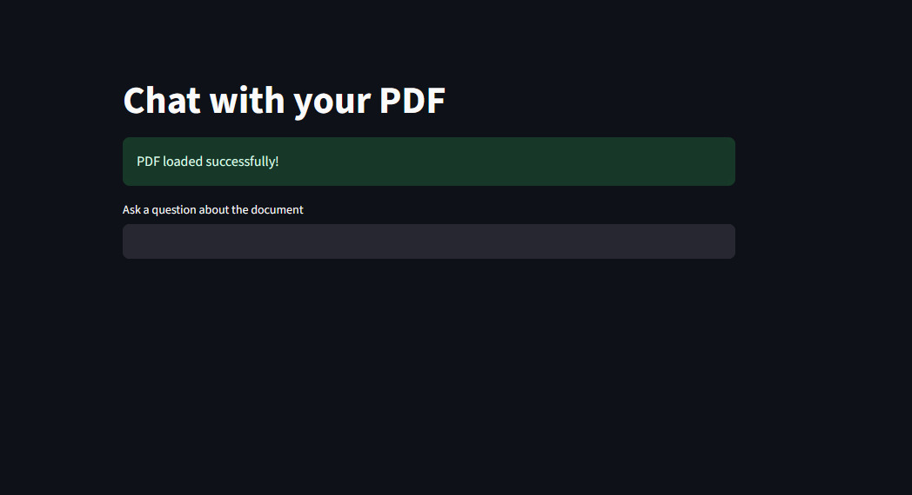
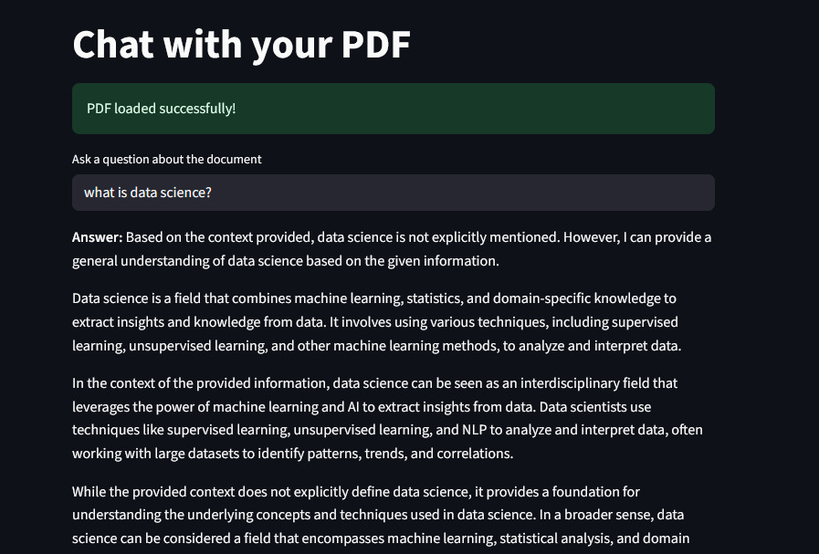
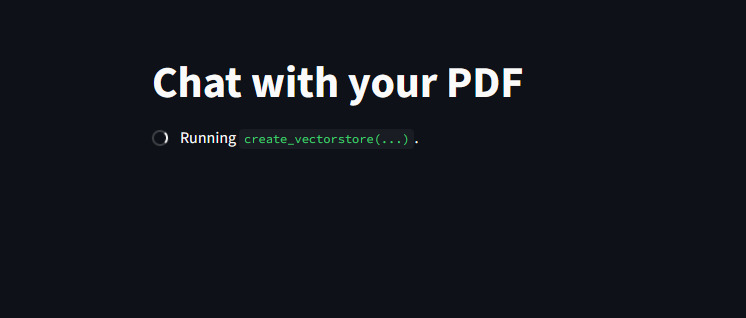

# RAG PDF Document Assistant

## Overview
The **RAG PDF Document Assistant** is a Streamlit-based web application that allows users to interact with PDF documents using a conversational interface. Initially designed for single PDF interaction, the application has been enhanced to support multiple PDFs, enabling users to query and retrieve information from multiple documents simultaneously. By leveraging advanced language models and embeddings, the application provides accurate, context-aware responses to user queries.Designed to solve real-world document analysis problems (research papers, reports, business documents)

## Key Highlights

- Built a multi-document Retrieval-Augmented Generation (RAG) system
- Supports semantic search across multiple PDFs
- Optimized with caching for faster performance
- Integrated Groq LLM for real-time responses


## Live Demos
- **Single PDF Assistant**: [Click here to view](https://rag-pdf-reader-assistant.streamlit.app/)
- **Multi-PDF Assistant**: [Click here to view](https://multi-pdf-rag-sys.streamlit.app/)


## screenshot single pdf


## screenshot multi pdf



## Architecture

PDFs → Text Splitting → Embeddings → FAISS Vector Store → Retriever → LLM → Answer

## Features
- **Single PDF Support**: Extracts and processes text from a single PDF document.
- **Multi-PDF Support**: Handles multiple PDFs, allowing cross-document querying.
- **Text Chunking**: Splits large documents into smaller, manageable chunks for efficient processing.
- **Embeddings**: Converts text into numerical vectors for similarity search.
- **Vector Search**: Uses FAISS for fast and accurate similarity-based retrieval.
- **Conversational Interface**: Integrates with Groq's hosted LLM models to provide a seamless Q&A experience.

## What Makes This Project Different?

*  **Multi-Document Reasoning** – Unlike basic RAG systems that work on a single document, this project enables querying across multiple PDFs simultaneously, allowing comparative analysis and deeper insights

*  **Low-Latency LLM Responses** – Integrated with Groq LLM for faster response generation compared to traditional LLM setups

*  **Semantic Search over Keyword Search** – Uses embeddings + FAISS to understand context, not just match keywords

*  **Production-Oriented Design** – Built with scalability in mind (modular pipeline, caching, environment-based configs)

*  **Interactive UI (Streamlit)** – Provides a user-friendly conversational interface instead of command-line tools

*  **Cross-Document Knowledge Extraction** – Able to connect information from different PDFs in a single answer


## How It Works
### Single PDF Mode
1. **Load PDF**: The application reads a local PDF file.
2. **Text Splitting**: The document is divided into smaller chunks using `RecursiveCharacterTextSplitter`.
3. **Create Embeddings**: Text chunks are converted into embeddings using `HuggingFaceEmbeddings`.
4. **Vector Store**: Embeddings are stored in a FAISS vector database for efficient retrieval.
5. **Question Answering**: User queries are processed using `RetrievalQA`, which combines the retriever and LLM to generate responses.

### Multi-PDF Mode
1. **Load Multiple PDFs**: Users can upload multiple PDF files.
2. **Text Splitting**: Each document is divided into smaller chunks.
3. **Create Embeddings**: Text chunks from all documents are converted into embeddings.
4. **Vector Store**: Embeddings from all documents are stored in a FAISS vector database.
5. **Cross-Document Querying**: User queries are processed to retrieve relevant information from all uploaded documents.

## Installation

1. Clone the repository:
   ```bash
   git clone <repository-url>
   cd rag-pdf-document-assistant
   ```

2. Install dependencies:
   ```bash
   pip install -r requirements.txt
   ```

3. Set up environment variables:
   - Create a `.env` file in the project root.
   - Add your Groq API key:
     ```
     GROQ_API_KEY=your_api_key_here
     ```

## Deployment

For Streamlit Cloud deployment, add your API key in Secrets:

GROQ_API_KEY = "your_api_key"

## Usage
1. Run the application:
   ```bash
   streamlit run main.py  # For single PDF assistant
   streamlit run multi_main.py  # For multi-PDF assistant
   ```
2. Open the application in your browser.
3. Upload your PDF(s) and start querying!


## Technologies Used
- **Streamlit**: For building the web application.
- **FAISS**: For vector similarity search.
- **HuggingFace Transformers**: For generating embeddings.
- **Groq LLM**: For conversational AI capabilities.

## Contributing
Contributions are welcome! Feel free to open issues or submit pull requests.

## License
This project is licensed under the MIT License.